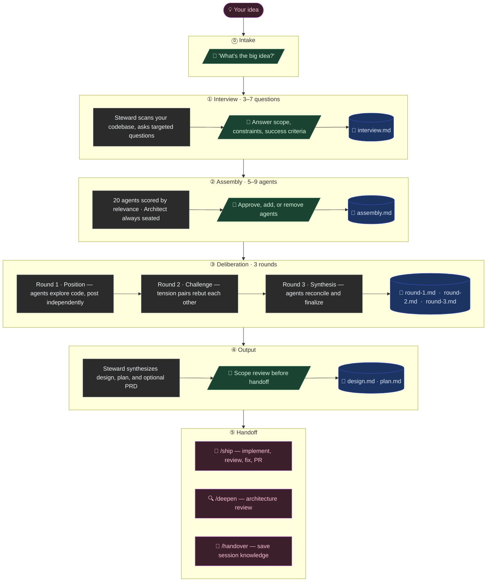

# agentic-council

> Convene 20 agentic specialists on your hardest engineering problems. Distinct perspectives, unified design, actionable plans, every decision tracked.

## Why a council

Hard engineering problems rarely have one right answer. The data model depends on the deployment story, the deployment story depends on the cost ceiling, the cost ceiling depends on what users will pay for. **agentic-council** brings in a roster of specialists to work the problem from every angle: an architect reasons about boundaries, a skeptic names what could break, a tuner argues about cost at scale, a guardian flags the privacy footprint. They post positions, challenge each other, and converge on a unified design. The Steward turns that design into a phased plan ready to hand to `/ship`.

## Every decision is tracked

Every phase writes to `.claude/council/sessions/<slug>/` as it happens: the interview, the assembled roster, each agent's position, every round of debate, the synthesis, and the final plan. Nothing is lost to a context window. Resume days later, list every council you've ever run, archive a session to a GitHub issue, or replay how a decision was reached when someone asks "why did we do it this way?".

## Install

```
/plugin marketplace add https://github.com/dtsong/agentic-council
/plugin install agentic-council
```

That's it for the core flow. As of v1.2.0 the council deliberates via Claude Code's **dynamic workflows** runtime (Claude Code ≥ 2.1.154, available on all paid plans) — the experimental agent-teams flag is **no longer required**. Optionally enable it to unlock live panel steering in `--meet` and team-based execution in Path A:

```bash
export CLAUDE_CODE_EXPERIMENTAL_AGENT_TEAMS=1   # optional
```

See [INSTALL.md](./INSTALL.md) for the full setup including troubleshooting. Without either runtime the engine degrades to sequential agent calls — slower, same artifacts.

## Quick start

```bash
/council --brainstorm "Should we migrate from Node to Bun?"
/council --quick      "Add a tournament coach feature"
/council --meet       "Re-architect the billing stack"
/council --audit      "Audit our authentication stack"
```

Each mode scales differently:

| Mode | Agents | Rounds | Backend | Use when |
|---|---|---|---|---|
| `--brainstorm` | 3 | 1 | inline | Gut check, pre-decision ideation |
| `--quick` | 3 | 1 | inline | You know roughly what you want |
| (default) | 3 to 7 | 3 | workflow | Ambitious feature, full deliberation |
| `--deep` | 3 to 7 | 3 + audit | workflow | Max rigor, ~1 hour |
| `--meet` | 3 to 7 | cross-exam | teams | Discussion only, no plan |
| `--audit` | 3 to 5 | passes | workflow | Adversarial codebase review |

Add `--profile lean|balanced|max` to any mode to control model spend — see the [Cost guide](#cost-guide).

## Cost guide

The council spawns real agents, so sessions have real token costs. The `--profile` flag routes each spawn site to a model tier; the conductor (interview, synthesis, PRD) always runs on *your* session model (`/model`).

| Spawn site | `lean` | `balanced` (default) | `max` |
|---|---|---|---|
| Positions & converge (R1/R3) | Sonnet | Opus | Opus |
| Challenge round (R2) | Opus one-shots | persistent agents | Fable one-shots |
| Audit agents | Sonnet | Sonnet | Opus |

Estimated total tokens (5-agent standard session): **lean** ~80–120K · **balanced** ~120–180K · **max** ~180–270K. Brainstorm is ~10–15K in every profile. The engine prints an estimate at the roster-approval gate before anything spawns.

**If you're API-billed (enterprise agreement, token-conscious):** run `--profile lean`. Positions and convergence run on Sonnet 4.6 ($3/$15 per MTok), and Opus is spent only where debate quality pays most — the adversarial challenge round. A Sonnet conductor is acceptable; expect a flatter design doc. Indicative pricing (June 2026): Sonnet 4.6 $3/$15, Opus 4.8 $5/$25, Fable 5 $10/$50 per MTok in/out — check current pricing before budgeting.

**If you're on a Claude Max plan ($100–200/mo):** there's no per-token dollar cost — sessions draw on your plan's rate limits. Run `--profile max` with `/model opus` (or fable) before a standard/deep session: synthesis and the design doc are conductor work and benefit most from the stronger model, and Fable-powered challenge rounds are where ceiling quality shows. Deep mode + max profile burns limits fastest; balanced is the sane default for daily use.

Workflow-backed deliberation also typically costs less than the old teams backend for the same session — workflow agents are lightweight subagents, while each teammate was a full Claude Code session loading CLAUDE.md, MCP servers, and skills.

## Example sessions

### 1. De-risk an ambitious feature before you build

```
/council "Add a tournament coach feature to our chess app"
```

The Strategist scopes the MVP, the Architect proposes the data model, the Tuner flags the LLM-call cost ceiling, the Skeptic names the failure modes, and the Advocate maps the user journey. After three rounds of debate, the Steward synthesizes a unified design and a phased build plan ready to hand to `/ship`. Every position, every round, and the final plan land in `.claude/council/sessions/<slug>/` so you can resume the work next week or archive the whole deliberation to a GitHub issue.

### 2. Pressure-test a tradeoff with an auditable trail

```
/council --brainstorm "Should we migrate from Azure to AWS?"
```

Three agents (Operator, Tuner, Skeptic) post positions in parallel, the Steward synthesizes the tradeoffs, and you walk away with a one-page decision brief instead of a vibes-based commitment. Six months later when someone asks "why did we choose AWS?", the full deliberation is still on disk and in the git commit history. Replay every argument that led to the call.

### 3. Adversarial audit of an existing system

```
/council --audit "Audit our authentication stack"
```

Cipher, Warden, Guardian, and Skeptic deliberate on cryptographic choices, privilege boundaries, compliance gaps, and attack surface. Output: a prioritized remediation list with clear owners, persisted alongside every other council session for cross-project pattern-spotting.

## How it works

1. **Intake.** "What's the big idea?"
2. **Interview.** Steward asks 3 to 7 questions to disambiguate scope, constraints, and success.
3. **Assembly.** Steward picks 3 to 7 council members based on the topic. Architect is always seated; Advocate, Skeptic, Guardian, and Tuner get bonus weight for relevant domains. You approve the roster — and see a token estimate — before anything spawns.
4. **Deliberation.** Three rounds run as a background workflow: Position, Challenge, Synthesis. Tension pairs surface organically (Skeptic vs Strategist, Operator vs Tuner). Round texts stay on disk and out of your session's context.
5. **Output.** Design doc, implementation plan, and an optional PRD ready to hand to `/ship`.



## Persistence and context handoff

Every session writes to `.claude/council/sessions/<slug>/` in your workspace, capturing each phase as a discrete artifact:

```
.claude/council/sessions/<slug>/
├── interview.md         # Phase 1 questions and answers
├── assembly.md          # Phase 2 roster and rationale
├── deliberation/
│   ├── round-1.md       # Each agent's opening position
│   ├── round-2.md       # Cross-examination and rebuttals
│   └── round-3.md       # Synthesis
├── design.md            # Phase 4 design doc
└── plan.md              # Phase 4 build plan
```

This is the key to the council pattern. Subsequent agents read prior rounds from disk so context flows agent-to-agent without bloating the parent context window. A 9-agent, 3-round deliberation that would blow past any single context window stays lean because each agent only loads what it needs.

Session lifecycle commands:

| Command | Purpose |
|---|---|
| `/council --resume` | Resume the most recent active session |
| `/council --resume <slug>` | Resume a specific session |
| `/council --list [--all]` | List sessions in this workspace (or all) |
| `/council --status` | Quick workspace summary |
| `/council --archive <slug>` | Export a session to a GitHub issue |
| `/council --cleanup` | Review and remove stale sessions |

A cross-workspace registry at `~/.claude/council/` tracks usage across projects, and `/handover` exports session knowledge for the next Claude conversation to pick up cold.

Plugin assets are read-only at `${CLAUDE_PLUGIN_ROOT}`. Session and registry data always lives in your workspace and home directory.

## Commands shipped

| Command | What it does |
|---|---|
| `/council "<idea>"` | Full workflow: interview, assembly, 3-round deliberation, design, plan |
| `/council --brainstorm "<idea>"` | 30-second gut check from 3 agents |
| `/council --quick "<idea>"` | Skip interview, single round |
| `/council --deep "<idea>"` | Full council plus mandatory deep audit |
| `/council --meet "<question>"` | Discussion only, no action plan |
| `/council --audit "<area>"` | Direct codebase audit |
| `/brainstorm "<idea>"` | Top-level alias for `/council --brainstorm` |
| `/ship` | Post-council pipeline: implement, review, fix, PR |
| `/deepen` | Architecture review, find shallow modules |
| `/handover` | Save session knowledge to a handover doc |

Run `/council --help` for the complete reference.

## The council

**Engineering and systems**
- **Architect** for system design, data models, APIs
- **Craftsman** for testing strategy, code quality, patterns
- **Operator** for DevOps, deployment, infrastructure
- **Tuner** for performance, scalability, optimization
- **Alchemist** for data engineering, ML workflows
- **Sentinel** for IoT, embedded, edge protocols
- **Pathfinder** for mobile, cross-platform, native

**Product and design**
- **Strategist** for business value, scope, MVP
- **Advocate** for UX, product thinking, accessibility
- **Artisan** for visual design, design systems, motion
- **Herald** for growth, monetization, onboarding
- **Scout** for research, precedent, external knowledge
- **Chronicler** for documentation, knowledge architecture

**Risk and integrity**
- **Skeptic** for risk, devil's advocate, edge cases
- **Guardian** for compliance, governance, privacy
- **Cipher** for cryptographic engineering, protocol security
- **Warden** for OS kernel security, isolation
- **Prover** for formal methods, mathematical verification
- **Oracle** for AI/LLM integration, RAG, prompt engineering

**Maestro**
- **Steward** facilitator and synthesizer (does not vote)

## Skills bundled (60)

Each council agent is paired with 2 to 4 first-class skills (e.g., `architect-schema-design`, `skeptic-threat-model`, `tuner-caching-strategy`, `guardian-compliance-review`). They load on demand during deliberation, or you can invoke them directly as `/agentic-council:<skill-name>`.

## Engineering guardrails

- `scripts/validate.py` runs 7 structural checks (manifest parsing, frontmatter completeness, roster cross-references, no hardcoded user paths, no held-back-dept leakage).
- GitHub Actions CI runs the validator and `claude plugin validate` on every push and PR.
- No telemetry, no network calls outside the agent runtime itself.

See [CONTRIBUTING.md](./CONTRIBUTING.md) for the full local dev workflow.

## License

Apache-2.0. See [LICENSE](./LICENSE).

## Cross-platform note

agentic-council is Claude Code only: deliberation runs on Claude Code's dynamic-workflows runtime (with agent teams as an optional enhancement), both Claude Code primitives. SKILL.md and agent persona files use minimal, portable frontmatter to ease future Codex and Gemini support. See [PLATFORMS.md](./PLATFORMS.md).
